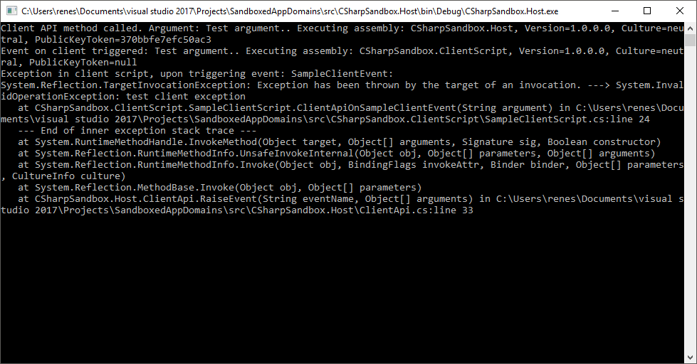

# C# Sandboxed App Domains example

This is an example on how to create secure(1) sandboxed app domains in order to execute untrusted code safely(1)

(1): The "secureness"/"safety" of this code is entirely debatable, and not guaranteed. Don't hold me liable.

## Granted permissions

The following permissions have been granted to the child domains:

* ReflectionPermissionFlag.MemberAccess
* SecurityPermissionFlag.Execution
* SecurityPermissionFlag.SerializationFormatter
* FileIOPermissionAccess.Read | FileIOPermissionAccess.PathDiscovery, in the directory of the client script
* FileIOPermissionAccess.Read | FileIOPermissionAccess.Write | FileIOPermissionAccess.Append | FileIOPermissionAccess.PathDiscovery, in the subdirectory "Data" from the client script's .dll

More explanation can be found under the `CreatePermissionSet()` method in [ScriptInstance.cs](src/CSharpSandbox.Host/ScriptInstance.cs)

## AppDomainToolkit

This project uses [@jduv](https://github.com/jduv)'s [AppDomainToolkit](https://github.com/jduv/AppDomainToolkit). Which makes it significantly easier to set up app domains like this.

Due to an issue discovered in the code, a custom compiled version of this library has been included (with permission) until the NuGet package gets updated. See [issue #25](https://github.com/jduv/AppDomainToolkit/issues/25).

## Sample code

The sample code demonstrates a plugin script (`CSharpSandbox.ClientScript`) which gets loaded into the host (`CSharpSandbox.Host`), and there's an exposed API `ClientApi`.

The plugin script demonstrates a receiving an event, which gets handled in the restricted `CSharpSandbox.ClientScript` domain, and it calling a method on the API, which gets handled in the `CSharpSandbox.Host` domain.

This is done over a single object instance of `ClientApi`. The plugin script only knows about the `IClientApi` interface, which exposes the event and methods. But the actual instance is declared inside `CSharpSandbox.Host`.

Also any exceptions thrown while invoking events are caught, to prevent the host from crashing due to a plugin script, as demonstrated below.



## .pfx password

In case you need it:

```
CSharpSandbox
```